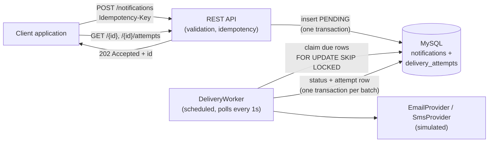
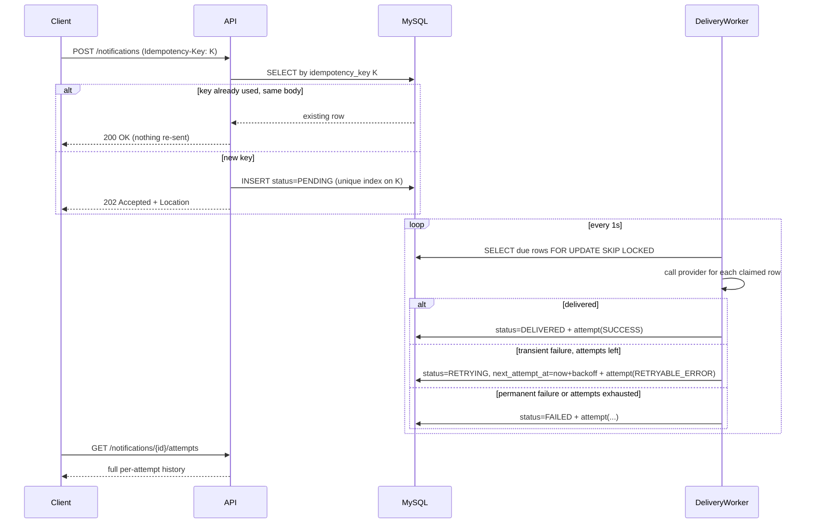
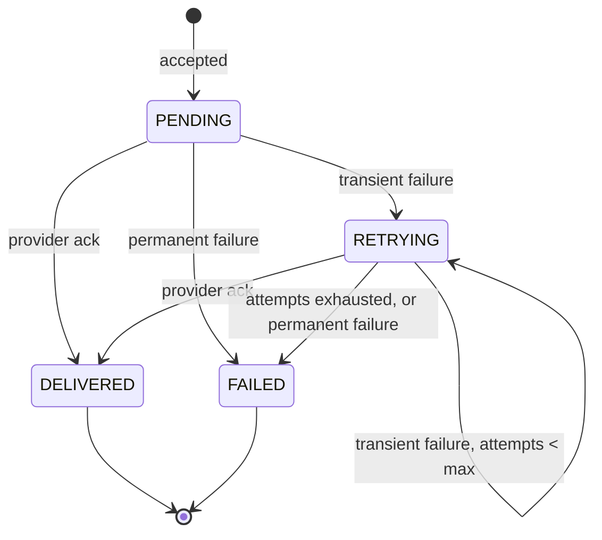

# Notification Delivery Service

Accepts a notification over HTTP, persists it, and delivers it asynchronously through email or
SMS (simulated), with idempotent intake, retry with backoff, and a per-attempt history you can
query later.

Java 21 · Spring Boot 3.3 · MySQL 8.4 · Flyway · Docker Compose · JUnit 5 + Testcontainers.

## Implementation approach

The service is designed around one core problem: accepting a notification quickly while allowing
delivery to complete asynchronously and safely after the original request has finished. The API
stores each request as a notification, returns its identifier immediately, and a scheduled worker
processes pending notifications through the selected channel provider.

### What I used and why

- **Java 21 and Spring Boot** provide a well-supported structure for the REST API, dependency
  injection, validation, scheduling, and operational health endpoints.
- **MySQL** stores the notification's current state and its append-only delivery-attempt history.
  A relational database fits because intake, idempotency, status changes, and attempt records need
  transactional consistency.
- **Spring Data JPA and Flyway** keep persistence code focused on the domain while making the
  database schema versioned and repeatable across environments.
- **Docker Compose** runs the API and MySQL together with a health-checked dependency, making the
  service easy to start consistently for local development and evaluation.
- **Database-backed idempotency** uses a unique key and request fingerprint. This prevents
  duplicate notifications even when concurrent retries arrive at the same time.
- **MySQL row locking with `FOR UPDATE SKIP LOCKED`** lets multiple worker instances claim
  different notifications without processing the same row concurrently.
- **Separate email and SMS provider implementations** keep channel-specific behavior behind a
  common interface. The providers are simulated so retry and failure behavior can be exercised
  without external credentials or third-party network dependencies.
- **Exponential backoff with a maximum attempt count** handles transient provider failures while
  preventing retries from continuing forever.
- **JUnit and Testcontainers** cover the retry calculation and database-dependent service behavior
  against a real MySQL instance rather than an in-memory substitute.

### What I did not use and why

- **No message broker or separate outbox**: the notification row acts as the durable queue, which
  keeps this small service to one infrastructure dependency while still supporting safe claiming.
- **No real email or SMS integrations**: external providers would require credentials, network
  setup, and provider-specific concerns that are outside this implementation's focus.
- **No authentication or rate limiting**: the service is intended for trusted internal callers
  behind an internal gateway in this iteration.
- **No dead-letter queue or replay endpoint**: failed records remain visible as `FAILED`, but an
  operator workflow for replay is intentionally deferred.
- **No scheduled sends, templates, bulk intake, webhooks, push, or letter channels**: these are
  useful extensions, but adding them would broaden the scope without improving the core
  asynchronous delivery, idempotency, and retry design being demonstrated here.
- **No metrics or distributed tracing**: production observability would be important, but the
  current version keeps the implementation focused on correctness and behavior that can be tested
  locally.

## Run it

```bash
docker compose up --build        # MySQL + API, Flyway migrations run on startup
```

- API: `http://localhost:8080/api/v1/notifications`
- Health: `http://localhost:8080/actuator/health`
- Swagger UI: `http://localhost:8080/swagger-ui/index.html`
- OpenAPI JSON: `http://localhost:8080/v3/api-docs`

Exercise the main flow (create, idempotent retry, status, attempt history, a permanent failure):

```bash
./scripts/smoke.sh
```

Stop / reset / test:

```bash
docker compose down             # stop, keep the DB volume
docker compose down -v          # stop and wipe all data

# tests — spins up its own throwaway MySQL via Testcontainers, needs Docker + JDK 21
gradle test
# or, with no local JDK at all:
docker run --rm -v "$PWD":/app -w /app gradle:8.10-jdk21 gradle --no-daemon test
```

Manual call:

```bash
curl -i -X POST http://localhost:8080/api/v1/notifications \
  -H 'Content-Type: application/json' \
  -H 'Idempotency-Key: order-4711-shipped' \
  -d '{"channel":"EMAIL","recipient":"ada@example.com","subject":"Shipped","body":"On its way."}'
```

## Why I picked this project, and why it's this size

I went with the notification service over the quota service because it forces you to deal with
work that outlives the request — the caller gets an answer immediately, but delivery might not
finish for seconds or fail three times before it does. That's a genuinely different problem than
CRUD-plus-validation.

I also deliberately kept it to **two channels and one retry strategy** instead of building out
everything the brief gestures at (push, physical letters, a dead-letter queue with an operator
replay endpoint, metrics, tracing, OpenAPI UI). All of that is real work, and claiming I built it
solidly in an hour wouldn't be honest. What's here is what I'd actually finish and be able to
defend line-by-line in this time box — the "what I cut" list further down is as much a part of
this submission as the code.

## Architecture



### Request lifecycle



### Delivery states



## The decisions that actually matter here

**Idempotency is a unique index, not a read-then-check.** Two concurrent retries of the same
request race. A `SELECT`-then-`INSERT` loses that race and sends twice. Here the DB rejects the
second insert on the unique `idempotency_key` column, and the loser just re-reads and returns the
winner's row. Same key with a *different* body is a caller bug — that gets `409`, not a silent
overwrite. What "same body" means is a SHA-256 fingerprint of the request fields, stored alongside
the row.

**The worker claims rows with `SELECT ... FOR UPDATE SKIP LOCKED`, not application-level locking.**
This is what makes it safe to run more than one instance of this service without them fighting
over the same notification: MySQL takes the row locks, a second poller (or a second tick of the
same poller) just skips whatever's already locked instead of blocking or double-processing. The
whole claim-and-process batch is one transaction, so the locks are held exactly as long as needed
and released together at commit.

**Retryable and permanent failures are modeled separately.** A timed-out provider call deserves
another attempt; an email address with no `@` in it never will, no matter how many times you retry
it. Providers return one of `SUCCESS / RETRYABLE_ERROR / PERMANENT_ERROR`, and only the retryable
case consumes the retry budget. Backoff is exponential (5s, 10s, 20s, 40s...) with a hard ceiling
so a bug can't produce an unbounded wait — I skipped jitter here; see below.

**`delivery_attempts` is append-only.** The notification row holds current state; the attempt rows
hold the full history. "Why did this fail?" is answerable per-attempt, with the provider's message
and timestamp, without having to reconstruct anything from logs.

**Delivery is at-least-once, not exactly-once.** A crash between a provider call succeeding and the
transaction committing means a retry re-sends. Exactly-once against a third party isn't really
achievable from this side; the honest fix is passing the notification's own id as the provider's
idempotency token, which is where a real integration would plug in.

## API reference

All errors share one shape: `{type, title, status, detail}`.

| Method | Path | Purpose |
|---|---|---|
| `POST` | `/api/v1/notifications` | Queue a notification. Body: `{channel, recipient, subject?, body}`. Optional `Idempotency-Key` header. Returns `202` (newly queued) or `200` (idempotent replay). `409` if the key was reused with a different body, `400` on validation errors. |
| `GET` | `/api/v1/notifications/{id}` | Current status, attempt count, next attempt time. `404` if unknown. |
| `GET` | `/api/v1/notifications/{id}/attempts` | Full per-attempt history (outcome, provider message, timestamp) for one notification. |
| `GET` | `/actuator/health` | Liveness/readiness, including DB connectivity. |

Example `202` body:

```json
{
  "id": "b3f1...",
  "channel": "EMAIL",
  "recipient": "ada@example.com",
  "subject": "Shipped",
  "status": "PENDING",
  "attemptCount": 0,
  "nextAttemptAt": "2026-09-19T21:00:00Z",
  "createdAt": "2026-09-19T21:00:00Z",
  "updatedAt": "2026-09-19T21:00:00Z"
}
```

## Assumptions

- Callers are trusted internal services — no auth in this iteration (would sit behind an internal
  gateway in reality).
- Providers are simulated; `DELIVERY_SIMULATED_FAILURE_RATE` (default `0.3`) is what makes retry
  behaviour visible within seconds of starting the stack, rather than needing a real outage.
- One deployable runs both the API and the worker loop; it can scale out because claiming is safe
  under concurrency (see above).
- A 1-second poll interval is an acceptable delivery latency at this volume; this is the first
  thing I'd make configurable per-environment if it weren't already.

## Tradeoffs I made on purpose

| Chose | Instead of | Because |
|---|---|---|
| MySQL row claiming (`SKIP LOCKED`) | A message broker + outbox | One transaction, one dependency; the queue row *is* the business row |
| Whole batch as one transaction | Per-row transactions | Simpler for a batch size of 10; I'd split this before raising the batch size (see below) |
| Fixed exponential backoff | Backoff + jitter | Jitter matters once many notifications queue up during a real outage and retry in lockstep; not worth the extra parameter for a demo-scale run |
| Two channels, fully working | Four channels, thinly stubbed | I'd rather defend two real implementations than hand-wave two more |
| Unit test on the pure backoff math + integration tests on the two things worth proving against real MySQL | A large end-to-end test suite | Time went to proving the concurrency-sensitive behaviour, not test coverage percentage |

## Left out, on purpose

Authentication and rate limiting; a dead-letter queue with an operator replay endpoint (failed
notifications just sit as `FAILED` — recoverable by direct DB access today, not by an API);
scheduled/delayed sends; templating; bulk intake; webhook callbacks to the caller instead of
polling; metrics export (Prometheus) and distributed tracing; push and letter channels.

## What I'd do next, in order

1. **Per-row transactions in the worker**, so a crash mid-batch only loses the row it was on, not
   the whole batch — worth doing before raising batch size much past what's here.
2. **A dead-letter view + manual replay endpoint** — right now a `FAILED` notification is only
   fixable by someone with DB access, which isn't good enough once another team depends on this.
3. **Metrics** — count by channel/status, a delivery-latency histogram, and an alert on the oldest
   pending notification's age, which is the real "are we stuck?" signal.
4. **Auth + per-caller rate limits**, before any external team gets a URL to this.
5. **Backoff jitter**, once there's a plausible thundering-herd scenario worth defending against.
6. **Webhook delivery receipts** so callers don't have to poll `GET /{id}`.

## Project layout

```
src/main/java/com/assignment/notifications/
├── api/        REST controller, DTOs, error handling
├── config/     typed retry/worker configuration
├── delivery/   ChannelProvider interface + Email/SMS implementations, backoff math
├── domain/     JPA entities and status/outcome enums
├── repo/       Spring Data repositories, incl. the SKIP LOCKED claim query
└── service/    intake logic, the scheduled worker, and batch processing
src/main/resources/db/migration/   Flyway schema
scripts/smoke.sh                    end-to-end walkthrough against the running stack
```
